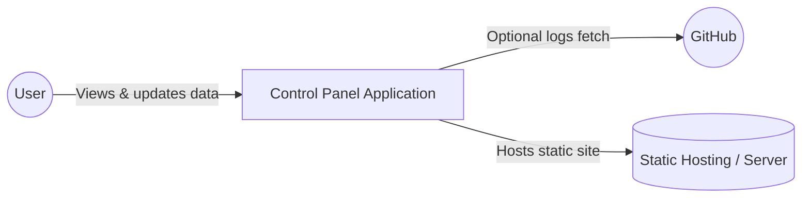
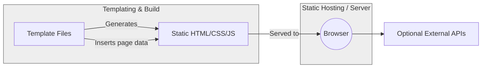
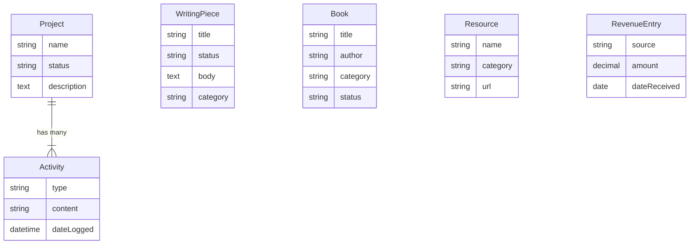
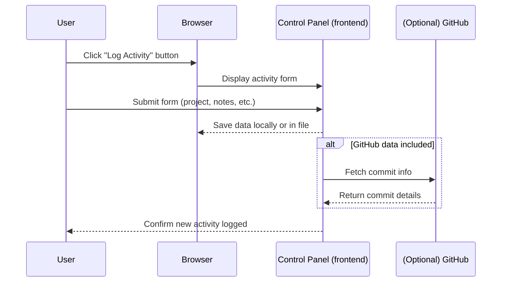

# (A) System Context Overview

The system is a **personal control panel** for managing various aspects of an individual’s workflow, including projects, revenue, writing, AI tools, resources, and books. Its primary actor is a **single end-user** (the owner of the control panel). Optional integrations or references include external data sources (e.g., GitHub activity logs), but these are loosely coupled and not deeply integrated.

**System Context Diagram (Mermaid)**

- **User** interacts with the control panel via a browser  
- **Optional External Services** (e.g., GitHub) may provide activity or commit information  
- **Hosting Environment** simply serves the static or generated pages to the user

# (B) High-Level Feature List (Functional Overview)

- **Dashboard:** Provides an overview of key metrics (projects, revenue, writing stats, etc.)  
- **Projects Management:** Allows organizing and tracking the status of various personal or side projects  
- **Revenue Tracking:** Displays revenue goals, monthly/annual progress, and recent transactions  
- **Writing Management:** Manages written content (blog posts, newsletters, documentation), with draft/published status  
- **AI Tools Library:** Lists prompts, templates, or other AI-related utilities  
- **Resources Catalog:** Collects external links and references, organized by category  
- **Book Tracking:** Maintains a list of books (covering details like author, category, status)  
- **Activity Dashboard:** Aggregates recent actions (manual logs, GitHub commits, pull requests), optional heatmaps, and quick log functionality  

# (C) Use Case Descriptions

Below are concise descriptions of core user flows. Actor: **User** (the individual who owns/uses the control panel).

1. **View Dashboard**  
   - **Goal:** See an overview of projects, revenue, and other metrics  
   - **Preconditions:** User has existing data (projects, revenue records, etc.)  
   - **Basic Flow:**  
     1. User navigates to the dashboard  
     2. System displays widgets summarizing the user’s data  
     3. User optionally clicks through to specific sections (projects, writing, etc.)  

2. **Manage Projects**  
   - **Goal:** Add, update, or review personal projects  
   - **Preconditions:** N/A (user can have zero or many projects)  
   - **Basic Flow:**  
     1. User navigates to the projects page  
     2. User sees a list of current projects with status and metadata  
     3. User clicks “New Project” to add details, or “View” to inspect an existing project  
     4. System updates or retrieves project data accordingly  

3. **Log Activity**  
   - **Goal:** Record progress or notes (optionally referencing external commits)  
   - **Preconditions:** User has at least one project  
   - **Basic Flow:**  
     1. User selects “Log Activity” from the activity or project detail page  
     2. User fills in relevant details (project, type of log, notes)  
     3. System saves the new activity entry  
   - **Alternate Flow:** If GitHub integration is configured, system can optionally pull commit data  

4. **Track Revenue**  
   - **Goal:** Monitor income streams, monthly goals, and transactions  
   - **Preconditions:** User has recorded or wants to record some revenue sources  
   - **Basic Flow:**  
     1. User visits the revenue page  
     2. System displays monthly/annual charts, goals, and a summary of sources  
     3. User can add new income entries or view details for existing ones  

5. **Manage Writing**  
   - **Goal:** Maintain a library of written content in various stages (draft, scheduled, published)  
   - **Preconditions:** User has or wants to create writing pieces  
   - **Basic Flow:**  
     1. User navigates to the writing section  
     2. User filters or searches existing pieces or clicks “New Content”  
     3. User edits or views the piece’s details (title, body, category, status, etc.)  
     4. System updates the writing repository accordingly  

6. **AI Tools & Prompt Library**  
   - **Goal:** Organize AI prompts or templates for easy reuse  
   - **Preconditions:** N/A  
   - **Basic Flow:**  
     1. User goes to AI Library  
     2. User sees a grid/list of prompts or AI utilities  
     3. User can create a new prompt or edit an existing one  
     4. System stores these prompts for later reference  

7. **Resources & Books**  
   - **Goal:** Collect external references and books in a structured manner  
   - **Preconditions:** N/A  
   - **Basic Flow:**  
     1. User navigates to “Resources” or “Books”  
     2. The system displays all items in either a grid or list view  
     3. User can add or remove items, assign categories, and track reading/completion status  

  
# (D) Architecture Overview (Container-Level Diagram)

**Textual Explanation**  
- **Static Site / Frontend:** A set of generated HTML, CSS, and JavaScript files. The user’s browser loads these pages for the main user interface.  
- **Templating System / Build Process:** A local or build-time utility that processes base templates and page content to produce the final HTML (ensuring consistent headers, footers, and layouts).  
- **No Traditional Database:** Data is primarily stored as structured pages or references. Any dynamic references (like GitHub commits) are optional and handled client-side or included in the user’s manual logs.  
- **(Optional) External Services:** External integrations (e.g., GitHub) can feed data, but the system mostly runs in a self-contained manner.  

**Container Diagram (Mermaid)**

# (E) Data Model / Conceptual ER Diagram

Conceptually, the control panel tracks data like **Projects**, **Activities**, **Resources**, **Books**, **Revenue Entries**, and **Writing Pieces**. While the code is largely static, we can represent them as logical entities and relationships:

- **Project**  
  - Has multiple **Activities**  
  - May have a set of **Next Steps**  

- **WritingPiece**  
  - Has a **status** (draft, published, scheduled)  
  - Belongs to one or more **categories** (blog, newsletter, etc.)  

- **Resource**  
  - Can belong to a **category** (development, design, productivity, etc.)  

- **Book**  
  - Has **category** and **status** (to-read, reading, completed)  

- **Revenue**  
  - Has multiple **sources** (consulting, digital products, affiliate)  
  - Summaries for monthly/annual totals  

**ER Diagram (Mermaid)**  

*(Note: Actual storage may be simple JSON or static references; diagram is for conceptual understanding.)*

# (F) (Optional) High-Level Sequence/Flow Diagram

Below is an example flow for **Logging a New Activity**:

# (G) Architecture Decision Records (ADRs)

1. **ADR: Use of a Static Build/Template System**  
   - **Context:** The system is built as static pages to be easily hosted and served.  
   - **Decision:** A custom template approach is used to insert content into a shared base layout.  
   - **Rationale:** Minimizes overhead, easy to deploy anywhere.  
   - **Consequences:** Updates require rebuilding the static files; no dynamic backend.

2. **ADR: Client-Side-Only Data**  
   - **Context:** The codebase does not include a traditional database or server-side data store.  
   - **Decision:** All data is either stored as static HTML (pages) or fetched from external services client-side.  
   - **Rationale:** Keeps architecture simple; personal usage means no multi-user concurrency.  
   - **Consequences:** More complex data interactions or real-time collaboration would require additional storage solutions.

3. **ADR: Centralized CSS with Utility-First Approach**  
   - **Context:** The design uses a utility-centric style approach with minimal custom rules.  
   - **Decision:** A single style file aggregates the design tokens and components.  
   - **Rationale:** Ensures consistency and speeds up layout tasks.  
   - **Consequences:** The style approach is not dependent on a specific library or framework but is intentionally consistent.

4. **ADR: Optional External Integrations**  
   - **Context:** Code references optional GitHub activity.  
   - **Decision:** Keep external integrations (e.g., commits, pull requests) purely optional.  
   - **Rationale:** Avoid complicating the core system.  
   - **Consequences:** Users who want those features enable them; others can ignore.

# (H) Short Wiki-Style Summary

**Overview**  
This Control Panel is a personal dashboard for self-management of projects, finances, writing, AI tools, resources, and books. It uses a simple static site generation approach with a templating system for consistent layouts, flexible partials, and minimal overhead.

**Key Sections**  
- **Projects:** Lists all personal projects with statuses and activity logs  
- **Revenue:** Displays monthly and yearly financial targets and progress  
- **Writing:** Organizes blog posts, newsletter items, and other written content  
- **AI Library:** Stores reusable AI prompts or other AI-based utilities  
- **Books & Resources:** Tracks reading lists and external references  

**Architecture Diagrams**  
See the System Context and Container-Level diagrams above for a high-level visual. The build system compiles the base layout and content into a final static site, which is then hosted on any static file server.

**Future Rework**  
For more robust data handling (e.g., multi-user workflows), a server-side backend or database integration could be introduced. Currently, the static approach suffices for a single-user, personal dashboard scenario.

These recommendations aim to preserve the simplicity of a mostly static personal dashboard while enabling more complex features if required.